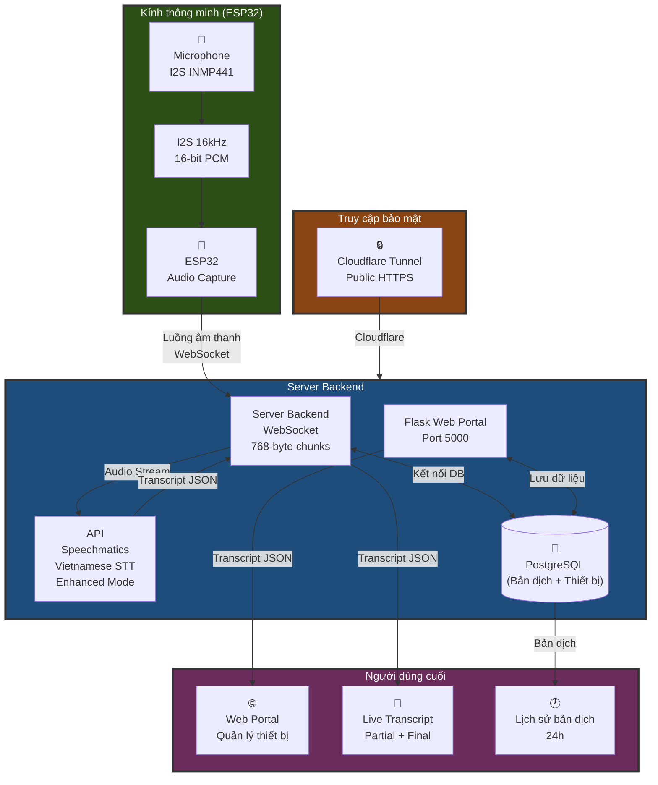

# Mắt Kính Hỗ Trợ Giao Tiếp - ESP32 Realtime Speech Recognition
<p align="center">
  
  
  
  
</p>
Hệ thống nhận dạng giọng nói tiếng Việt real-time dành cho người khiếm thính — ESP32 thu âm & stream audio qua WebSocket, server Python xử lý với Speechmatics API, hiển thị transcript trên Web Portal.

Real-time Vietnamese speech recognition system for the hearing impaired — ESP32 captures & streams audio via WebSocket, Python server processes with Speechmatics API, displaying transcripts on a Web Portal.

Tổng quan

Dự án này xây dựng một hệ thống hoàn chỉnh bao gồm:

- ESP32 thu âm và stream audio realtime qua WebSocket
- Server Python xử lý audio với Speechmatics API (nhận dạng tiếng Việt)
- Web Portal quản lý thiết bị, cấu hình WiFi và lịch sử transcript
- Cloudflare Tunnel để truy cập từ xa an toàn

## Demo

<table>
  <tr>
    <th>Hardware Overview</th>
    <th>OLED Display</th>
    <th>Close-up Display</th>
    <th>Wearing Demo</th>
  </tr>
  <tr>
    <td align="center">
      <br/>
      <em>Thiết kế tổng thể mắt kính thông minh với ESP32, I2S Microphone và OLED</em>
    </td>
    <td align="center">
      <br/>
      <em>Màn hình OLED hiển thị "Xin chào các bạn!" thời gian thực</em>
    </td>
    <td align="center">
      <br/>
      <em>Cận cảnh OLED 0.96" SSD1306 và I2S Microphone</em>
    </td>
    <td align="center">
      <br/>
      <em>Demo người dùng đeo và sử dụng thiết bị</em>
    </td>
  </tr>
</table>

## Tính năng chính

### 1. Nhận dạng giọng nói realtime
- Nhận dạng tiếng Việt với độ chính xác cao
- Hiển thị partial transcript (tạm thời) và final transcript (hoàn chỉnh)
- Độ trễ thấp, phù hợp cho giao tiếp trực tiếp

### 2. Quản lý thiết bị
- Đăng ký và quản lý nhiều thiết bị ESP32
- Theo dõi trạng thái online/offline realtime
- Hiển thị thông tin kết nối (IP, MAC address, RSSI)

### 3. Cấu hình WiFi từ xa
- Cập nhật cấu hình WiFi cho ESP32 qua web portal
- Lưu trữ nhiều cấu hình WiFi cho mỗi thiết bị
- ESP32 tự động lấy cấu hình mới khi khởi động

### 4. Lịch sử transcript
- Lưu trữ toàn bộ transcript vào PostgreSQL database
- Xem lịch sử 24 giờ gần nhất
- Phân biệt partial và final transcript

### 5. Bảo mật
- Xác thực người dùng với bcrypt password hashing
- Mỗi thiết bị chỉ được truy cập bởi chủ sở hữu
- Session management an toàn

## Kiến trúc hệ thống



## Công nghệ sử dụng

### Backend
- Python 3.8+
- Flask - Web framework
- Speechmatics SDK - Speech recognition API
- WebSockets - Realtime communication
- PostgreSQL - Database
- psycopg2 - PostgreSQL adapter

### Frontend
- HTML/CSS/JavaScript
- Bootstrap - UI framework
- AJAX - Async requests

### Infrastructure
- Cloudflare Tunnel - Secure public access
- Windows Batch scripts - Service management

## Cài đặt

### Yêu cầu hệ thống
- Python 3.8 trở lên
- PostgreSQL 12 trở lên
- Cloudflared CLI (optional, cho remote access)
- ESP32 với microphone I2S

### Bước 1: Clone repository

```bash
git clone <repository-url>
cd <project-folder>
```

### Bước 2: Tạo Python virtual environment

```bash
python -m venv .venv
.venv\Scripts\activate
```

### Bước 3: Cài đặt dependencies

```bash
pip install -r web_portal/requirements.txt
pip install speechmatics websockets httpx
```

### Bước 4: Cấu hình PostgreSQL

Tạo database và import schema:

```bash
psql -U postgres
CREATE DATABASE esp32_management;
\c esp32_management
\i database/schema.sql
```

### Bước 5: Cấu hình environment variables

Tạo file `.env` trong thư mục `web_portal`:

```
DB_HOST=localhost
DB_NAME=esp32_management
DB_USER=postgres
DB_PASSWORD=your_password
DB_PORT=5432
SECRET_KEY=your_secret_key
```

### Bước 6: Cấu hình Speechmatics API

Đăng ký tài khoản tại [Speechmatics](https://www.speechmatics.com/) và lấy API key.

Cập nhật API key trong file `final_lap/esp32_realtime_server.py`:

```python
API_KEY = "your_speechmatics_api_key"
```

## Sử dụng

### Khởi động tất cả dịch vụ

Chạy file batch script:

```bash
start_all.bat
```

Script sẽ tự động khởi động:
1. ESP32 Audio Server (port 8765)
2. Cloudflare Tunnel (public access)
3. Web Portal (port 5000)

### Truy cập Web Portal

- Local: http://localhost:5000
- Mobile (cùng mạng): http://[your-ip]:5000
- Public: https://esp32.ptitavitech.online (qua Cloudflare Tunnel)

### Thêm thiết bị mới

1. Đăng ký tài khoản trên Web Portal
2. Đăng nhập và chọn "Thêm thiết bị"
3. Nhập thông tin thiết bị và cấu hình WiFi
4. Upload code lên ESP32
5. ESP32 sẽ tự động kết nối và đăng ký với server

### Cấu hình ESP32

ESP32 cần được lập trình để:
- Kết nối WiFi
- Thu âm từ microphone I2S (16kHz, 16-bit PCM)
- Gửi audio qua WebSocket đến server (ws://server-ip:8765)
- Nhận và hiển thị transcript

## Cấu trúc thư mục

```
.
├── database/                   # Database schema và migrations
│   ├── schema.sql             # PostgreSQL schema
│   ├── add_speaker_column.sql # Migration: thêm cột speaker
│   └── MIGRATION_GUIDE.md     # Hướng dẫn migration
├── final_lap/                 # Production server
│   ├── esp32_realtime_server.py  # Main audio server
│   ├── config.yml             # Cloudflare tunnel config
│   └── ESP32_Realtime_Streaming/ # ESP32 firmware
├── server_lap/                # Development server
│   └── lap_realtime_server.py # Test server
├── web_portal/                # Flask web application
│   ├── app.py                 # Main Flask app
│   ├── requirements.txt       # Python dependencies
│   └── templates/             # HTML templates
└── start_all.bat              # Startup script
```

## API Endpoints

### Device Management

- `POST /api/device/register` - Đăng ký thiết bị mới
- `POST /api/device/disconnect` - Báo thiết bị ngắt kết nối
- `POST /api/device/heartbeat` - Gửi heartbeat
- `GET /api/device/status/<device_id>` - Lấy trạng thái thiết bị

### WiFi Configuration

- `POST /update_wifi/<device_id>` - Cập nhật cấu hình WiFi
- `GET /api/device/wifi-config/<device_id>` - Lấy cấu hình WiFi
- `POST /api/device/wifi-status` - Báo trạng thái kết nối WiFi

### Transcript Management

- `POST /api/text/save` - Lưu transcript
- `GET /device/<device_id>/text-history` - Lấy lịch sử transcript

## 👤 Author

**Nguyen Nhu Tuan** - [@tuannguyen1229](https://github.com/tuannguyen1229)


